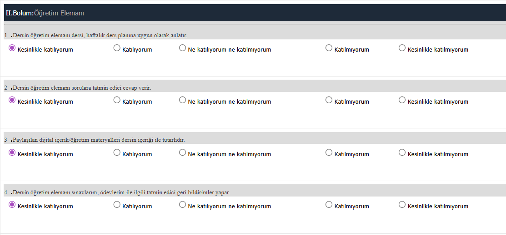

# Proliz Survey Auto-Filler

A browser extension to automatically fill surveys of proliz.

## How to Install
1. Download this folder.
2. Open your browser extensions page (`chrome://extensions` or `edge://extensions`).
3. Turn on **Developer mode** (top right switch).
4. Click **Load unpacked** and select /src folder.

## How to Use
1. Open a survey page on the student portal.
2. You will see **Auto Fill** button at the top of survey  if not move to section number 5 below
3. Choose the answer you want to give (e.g., "Kesinlikle katılıyorum").
4. Click **Auto Fill**.

OR
 
5. Click the extension icon.
6. Choose the answer you want to give (e.g., "Kesinlikle katılıyorum").
7. Click **Auto Fill**.

## Disclaimer
I only used this on Student System of Arel University so I am not sure is it going to work on other Proliz made student systems but give it a try especially if your system looks like the following image

